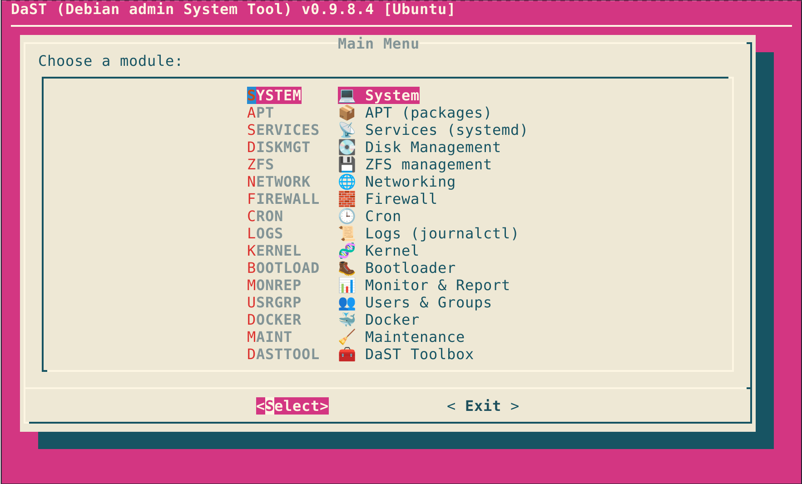

# DaST - Debian admin System Tool 🛠️

<p align="center">
  
</p>

**Version:** v0.9.8.4 (alpha) NOTE: Some functions may be incomplete or have errors. This is WIP.


DaST is a modular, menu-driven system administration toolkit for Debian and Ubuntu systems.

Its primary goal is to bring together a collection of common system administration tools into a single, coherent, interactive interface. Rather than replacing existing tools, DaST provides a structured way to discover, navigate, and use these tools.

Because system administration tools are powerful and often unforgiving, DaST also places a strong emphasis on visibility, confirmation, and explicit user intent.

DaST is not a replacement for learning Linux. It is a framework for using system tools in a more cohesive and considered way.

---

## Why DaST Exists ❓

I’ve always liked SUSE’s YaST (even if it does make you a bit lazy), but I prefer Debian and mainly Ubuntu as operating systems.

On Debian and Ubuntu, system administration is typically performed using many individual tools, each excellent in isolation but scattered across different commands, configuration files, and workflows. Finding the right tool, remembering the correct invocation, and understanding the impact of a change often requires context switching and prior knowledge.

DaST aims to bring a more structured, unified approach to system administration. It takes inspiration from YaST’s approach and applies it to Debian/Ubuntu systems using tools that already exist underneath.

---

## What DaST Is (and Is Not)

### DaST is: ✅

- 🧭 An interactive, menu-driven TUI for system administration
- 🧩 A cohesive front-end to existing Debian/Ubuntu tools
- 📜 A modular and readable Bash toolkit
- 🔐 Designed to be run interactively as root
- 👁️ Focused on visibility, confirmation, and explicit user intent
- 🧵 Designed to run in both terminal emulators and pure TTY environments (including SSH, local consoles, serial, and recovery environments)

For this reason, DaST intentionally restricts menu icons to single Unicode codepoints to ensure consistent rendering in TTY environments.

------

### DaST is not: 🚫

- 🪟 A GUI replacement for GNOME/KDE tools
- 🧰 A configuration deployment system (it is not Ansible)
- 🎩 A magic abstraction that hides Linux from you
- ⏱️ A “run once and forget” script

If you understand Bash, you can understand DaST.

---

## Design Approach 🧠

Existing tools are brought together behind a consistent interface, not hidden or replaced.  
DaST aims to reduce context switching without obscuring what is actually happening on the system.

### Visibility by default 👀

DaST does not silently rewrite configuration files or apply changes without making them visible to the user.

### Safeguards where it matters

Some administrative actions are inherently dangerous. Where an operation could:

- break networking 🌐
- lock you out over SSH 🔒
- destroy data 💥
- make the system unbootable 🤯

DaST will prompt clearly, provide context, and require explicit confirmation.

The guardrails are not the goal, but a natural consequence of bringing powerful tools together in one place.

### Plain Bash, on purpose ✅

DaST is written in Bash using standard system tools.

This means:

- no hidden dependencies
- no background daemons
- no opaque frameworks
- everything is readable and auditable

---

## AI assistance 🤖

I am not a Bash expert. AI assistance helped make this project possible.

All design choices, testing, and responsibility remain human, and you should review the code before running it on any system.

---

## Requirements 📦

The following is required for the interactive interface:

- dialog (chosen over whiptail due to feature limitations)

Optional tools are used by specific modules and are checked at runtime:

- systemd / systemctl
- ufw or nftables
- zfsutils-linux [Ubuntu]
- docker

Modules that are not applicable to the current system will not register (see below).

---

## Module gating and system compatibility 🧩

DaST modules register dynamically at runtime.

Certain modules perform explicit checks for:
- supported distributions
- init systems
- package managers
- required tooling

If a module is not applicable to the current system, it will not register and will not appear in the menu. This is intentional.

DaST does not attempt to force unsupported tooling onto a system.

### Supported / gated modules

| Module   | Requirements | Will load on | Will NOT load on |
|----------|-------------|--------------|------------------|
| APT | Debian-family system using APT | Debian, Ubuntu, Kubuntu, Xubuntu, Lubuntu | KDE Neon |
| ZFS | zfsutils-linux available and supported | Ubuntu, Kubuntu, Xubuntu, Lubuntu (Thanks Canonical, you are awesome! ❤️) | Debian |
| Services | systemd / systemctl | systemd-based distros | Devuan, sysvinit-only systems |
| Cron | supported cron implementation present (cronie, vixie-cron, or systemd timers) | Systems with supported cron tooling | Systems without a supported cron implementation |
| Firewall | ufw or nftables present | Systems with supported tooling | Systems without firewall tooling |
| Docker | docker installed | Systems with Docker | Systems without Docker (installable via APT menu) |

### Notes 📘

- **KDE Neon** is intentionally excluded from APT module support. While it is Ubuntu-based, Neon explicitly discourages direct APT usage for system management.
  
- **Debian** does not load the ZFS module by default. This avoids encouraging high-maintenance ZFS configurations, where DKMS and kernel version alignment requires careful, manual oversight and can impact pool availability if mishandled. This is a deliberate scope decision. Debian users who run ZFS successfully are expected to manage it directly using native tooling. ZFS support on Debian may be considered in the future if a robust, predictable integration can be achieved without increasing maintenance risk.
  
- **Non-systemd systems** (e.g. Devuan) will not load the Services module.

- **Cron / Scheduled Tasks** modules will only register if a supported cron implementation is detected (such as `cronie`, `vixie-cron`, or systemd timers). If no supported scheduler is present, the module will remain hidden.

This gating is a design feature, not a limitation and is designed to safe-guard. If a module is visible, DaST believes it is appropriate for that system.

---

## Quick Start 🚀

```bash
git clone https://github.com/ellnic/DaST.git
cd DaST
chmod +x DaST*.sh
sudo ./DaST_v0.x.x.x.sh
```

## Repository layout 📁

- `DaST_v0.9.8.4.sh` (launcher)
- `lib/` (shared libraries: config, theme, priv, UI, helper)
- `modules/` (feature modules)
- `config/dast.conf` (auto-created on first run)
- `logs/run_<RUN_ID>/dast.log` (per-run log)
- `debug/run_<RUN_ID>/...` (only when using debug flags)

## Debug flags (contributors / diagnostics)

- `--debug`  
  Enables Bash xtrace + error trapping.

  Debug artefacts are written to a per-run directory under `debug/`:
  - `debug/run_<RUN_ID>/dast_trace.log` (xtrace)
  - `debug/run_<RUN_ID>/dast_err.log` (ERR trap messages)

  A main run log is also written under `logs/`:
  - `logs/run_<RUN_ID>/dast.log`

- `--debug-gen` (also accepts `--debuggen`)  
  Generates a single diagnostics report and exits immediately (no TUI). Output:
  - `debug/run_<RUN_ID>/dast_debuggen_YYYYMMDD_HHMMSS.txt`

`LOG_DIR`, `DEBUG_DIR`, `CFG_DIR`, and `DAST_RUNTIME_DIR` can be overridden via environment variables if you want these written elsewhere.

Please treat debug outputs as potentially sensitive before sharing.

---

## Project Status and Disclaimer ⚠️

**DaST IS CURRENTLY IN ITS INFANCY AND SHOULD BE CONSIDERED ALPHA SOFTWARE! DaST MAY CONTAIN BUGS LEADING TO SYSTEM BREAKAGE AND DATA DESTRUCTION. YOU SHOULD REVIEW THE CODE YOURSELF BEFORE RUNNING IT. DaST COMES WITH ABSOLUTELY NO WARRANTY, EXPRESS OR IMPLIED, AND THE AUTHORS OR COPYRIGHT HOLDERS SHALL NOT BE LIABLE FOR ANY LOSS OR DAMAGES RESULTING FROM USING THESE SCRIPTS. YOU USE AT YOUR OWN RISK. THESE SCRIPTS ARE PROVIDED "AS IS" AND IN "GOOD FAITH" WITH THE INTENTION OF IMPROVING UBUNTU/DEBIAN FOR EVERYONE.**

As such, it should not be used on production systems or in environments where data integrity and uptime are critical.

DaST is tested through extensive real-world use, but there are practical limits to how much coverage one person can achieve across all environments. Additional testing, feedback, and contributions from others are always welcome and help strengthen the project over time.

This project has been developed over many hours as a practical, hands-on system administration tool and learning exercise. It has been used successfully on real systems, but it is still evolving.

As with any administrative tooling, your mileage may vary. Bugs and edge cases are expected at this stage, and fixes and improvements are ongoing.

You should review the code before use and never rely on DaST as a guarantee against mistakes.

---

## Licence 📄

DaST is released under the GNU General Public License v3.0 or later.
